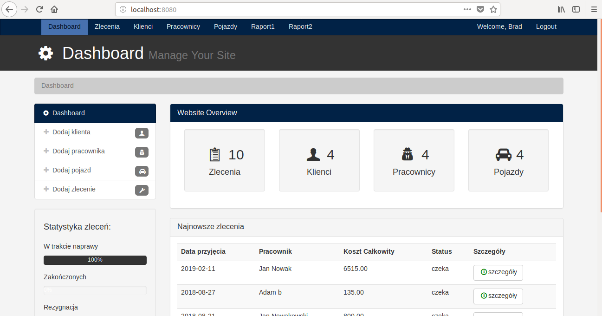
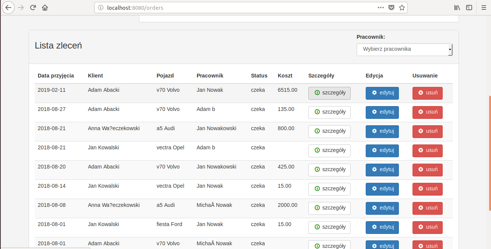
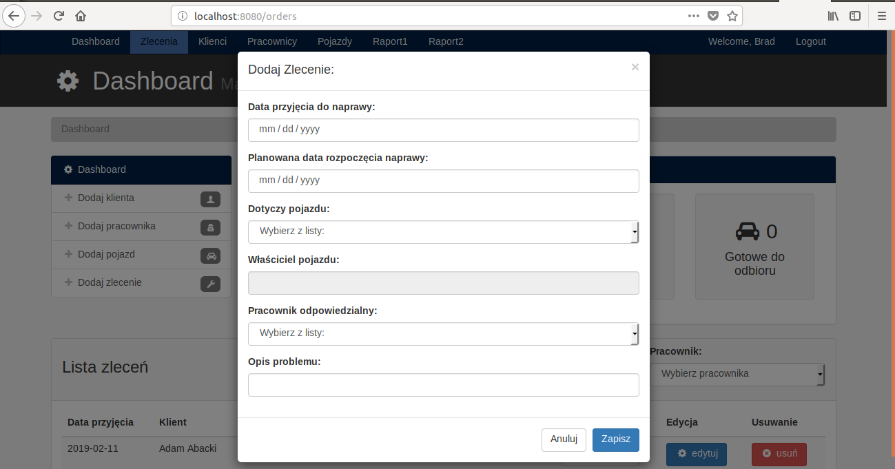

# Car_Workshop

Application with access for the car workshop manager. The administrator manages the classes of employees, clients, cars, repair orders.
The application uses:
1. Libraries: servlet-api, mysql-connector, jstl, gson
2. In the viewing layer: HTML, CSS, JSP, Bootstrap, JavaScript, JQuery, ajax

